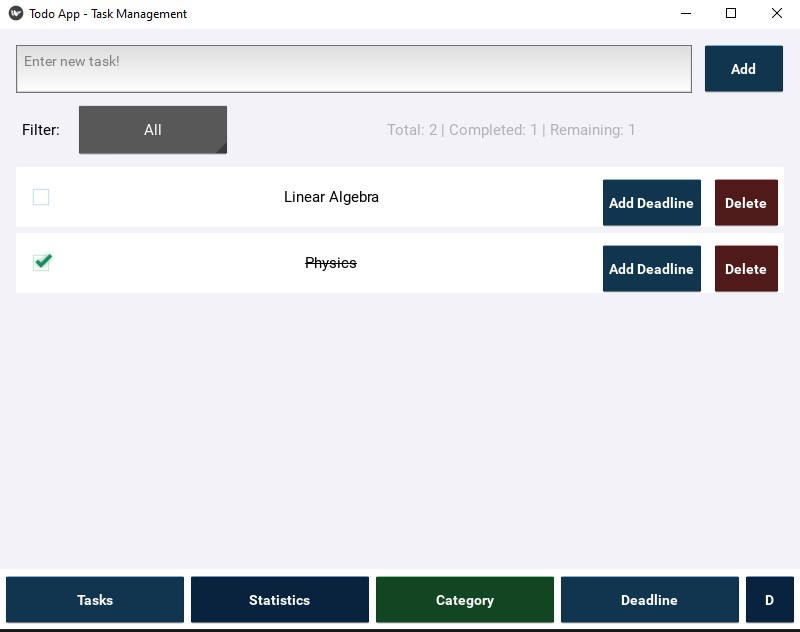
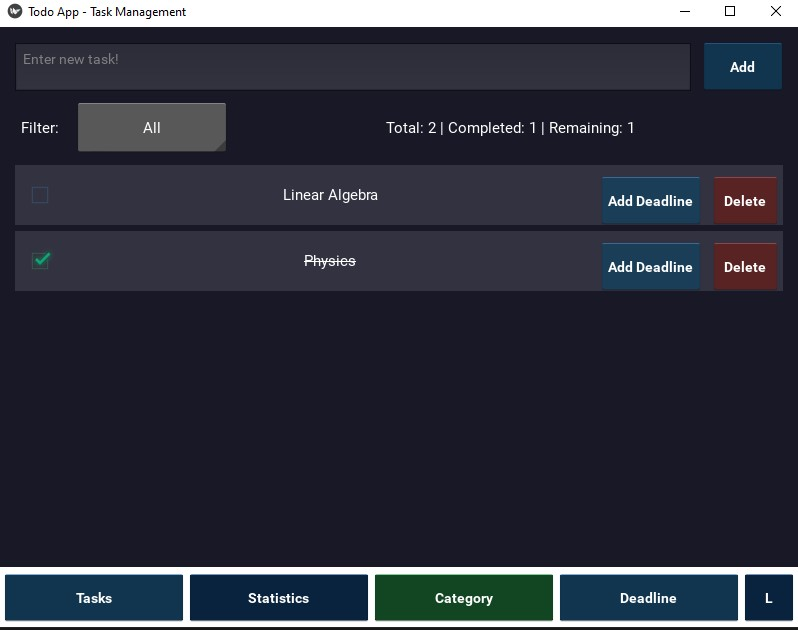
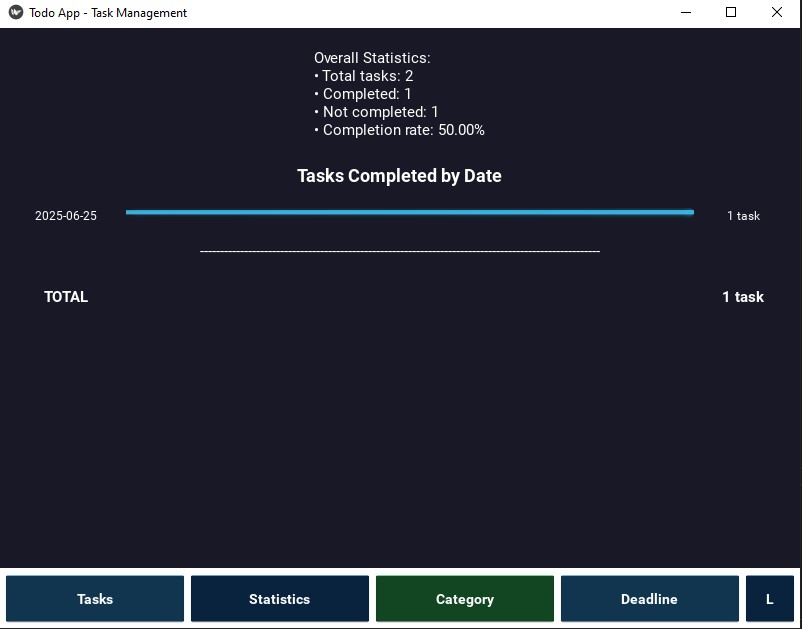
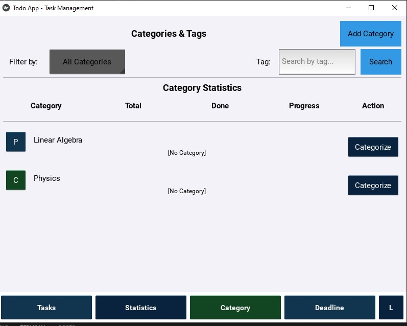
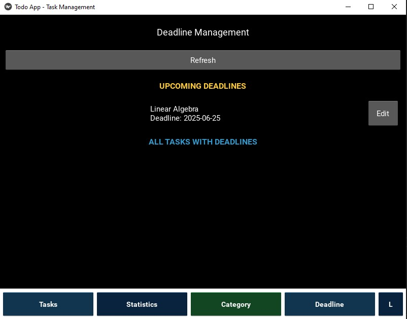

# Modern Kivy To-Do App


A versatile task management application built with Python and the Kivy framework. This app features a modern user interface, supports Light & Dark themes, and provides powerful features to help you manage your daily tasks effectively.

<!-- TODO: Add a screenshot of the application here -->
 
## 📸 Screenshots

### Task Management Interface (Light theme)


### Task Management Interface (Dark theme)


### Statistics Overview


### Category verview


### Deadline Overview



## ✨ Features

- **Core Task Management**: Add, delete, and mark tasks as complete.
- **Modern UI**: Custom UI components (buttons, text inputs) for a modern look and feel.
- **Light & Dark Themes**: Easily switch between two interface modes to suit your preference.
- **Category Management**:
  - Create custom categories (e.g., Work, Personal, Study).
  - Assign tasks to categories.
  - View progress statistics for each category.
  - Filter tasks by category.
- **Tag Management**:
  - Add tags to tasks for more detailed classification.
  - Search and filter tasks by tags.
- **Deadline Management**:
  - Set due dates and times for tasks.
  - Automatically view overdue and upcoming tasks.
  - Receive reminder notifications for upcoming deadlines.
- **Visual Statistics**:
  - View an overall summary of tasks (total, completed, pending).
  - Chart displaying the number of tasks completed by date.
- **Persistent Storage**: All data is stored locally using SQLite, allowing the app to work offline.

## 🛠️ Tech Stack

- **Language**: Python 3
- **Framework**: Kivy
- **Database**: SQLite 3

## 🚀 Getting Started

To run the application on your local machine, follow these steps:

### 1. Prerequisites

- [Python 3.7](https://www.python.org/downloads/) or newer.
- `pip` (usually comes with Python).

### 2. Installation Steps

**a. Clone the repository:**

```bash
git clone <YOUR_REPOSITORY_URL>
cd <your_repository_folder>
```

**b. Create and activate a virtual environment (recommended):**

- **On Windows:**
  ```bash
  python -m venv venv
  .\venv\Scripts\activate
  ```
- **On macOS/Linux:**
  ```bash
  python3 -m venv venv
  source venv/bin/activate
  ```

**c. Install the required dependencies:**

```bash
pip install kivy
```

**d. Run the application:**

```bash
python main.py
```
The application will launch and automatically create the `data/todo.db` database file if it doesn't exist.

## 📁 Project Structure

For the project to run correctly, you need to organize the files according to the following structure. Your Python modules should be placed in the `models/` subdirectory (except for `main.py`).

```
your-project-root/
├── main.py                 # Main entry point to run the app
├── README.md               # This README file
│
├── data/                   # Automatically created directory for data storage
│   ├── todo.db             # SQLite database file
│   └── theme.json          # Stores the current theme setting
│
└── models/                 # Contains the application's modules
    ├── __init__.py         # (Recommended, can be empty)
    ├── database.py         # Manages DB connection and queries
    ├── custom_ui.py        # Custom UI widgets and UI configuration
    ├── todo_screen.py      # Main task management screen
    ├── category.py         # Category and tag management screen
    ├── deadline.py         # Deadline management screen
    └── stats_screen.py     # Statistics screen
```

## 📖 How to Use

1.  **Add a Task**: Enter the task name in the input field at the top of the "Tasks" screen and press the "Add" button.
2.  **Complete a Task**: Click the checkbox to the left of the task.
3.  **Delete a Task**: Press the "Delete" button on the right side of the task.
4.  **Navigate**: Use the navigation buttons at the bottom to switch between screens:
    - **Tasks**: View and manage the to-do list.
    - **Statistics**: View statistics and charts.
    - **Category**: Manage categories, tags, and filter tasks.
    - **Deadline**: Manage deadlines.
5.  **Switch Theme**: Click the **D/L** (Dark/Light) button in the bottom-right corner to toggle the theme.
6.  **Manage Categories**: On the "Category" screen, press "Add Category" to create a new one. To assign a task to a category, go to the "Category" screen and click the "Categorize" button on a task.
7.  **Set a Deadline**: On the "Tasks" screen, click the "Add Deadline" button on a task to open the setup popup.

## 🤝 Contributing

Contributions are welcome! If you have ideas for improvements, please feel free to create a `pull request` or open an `issue`.
```